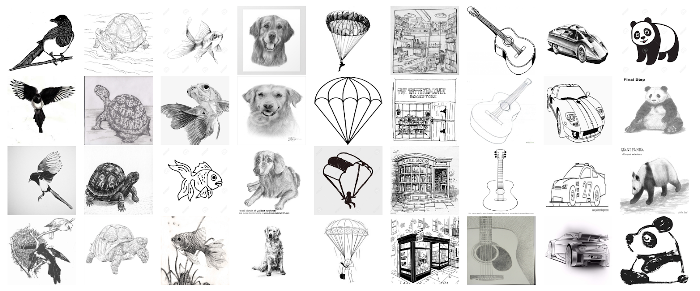

.. Sketch Image Classification - Boost Camp 7th, Team CV-01 documentation master file, created by
   sphinx-quickstart on Tue Sep 10 14:51:56 2024.
   You can adapt this file completely to your liking, but it should at least
   contain the root `toctree` directive.

Boost Camp 7th, Team CV-01 documentation
======================================================================

소개
----

Sketch이미지 분류 경진대회는 주어진 데이터를 활용하여 모델을 제작하고 어떤 객체를 나타내는지 분류하는 대회입니다.

Computer Vision에서는 다양한 형태의 이미지 데이터가 활용되고 있습니다. 이 중, 비정형 데이터의 정확한 인식과 분류는 여전히 해결해야 할 주요 과제로 자리잡고 있습니다. 특히 사진과 같은 일반 이미지 데이터에 기반하여 발전을 이루어나아가고 있습니다.

하지만 일상의 사진과 다르게 스케치는 인간의 상상력과 개념 이해를 반영하는 추상적이고 단순화된 형태의 이미지입니다. 이러한 스케치 데이터는 색상, 질감, 세부적인 형태가 비교적 결여되어 있으며, 대신에 기본적인 형태와 구조에 초점을 맞춥니다. 이는 스케치가 실제 객체의 본질적 특징을 간결하게 표현하는데에 중점을 두고 있다는 점을 보여줍니다.

이러한 스케치 데이터의 특성을 이해하고 스케치 이미지를 통해 모델이 객체의 기본적인 형태와 구조를 학습하고 인식하도록 함으로써, 일반적인 이미지 데이터와의 차이점을 이해하고 또 다른 관점에 대한 모델 개발 역량을 높이는데에 초점을 두었습니다. 이를 통해 실제 세계의 복잡하고 다양한 이미지 데이터에 대한 창의적인 접근방법과 처리 능력을 높일 수 있습니다. 또한, 스케치 데이터를 활용하는 인공지능 모델은 디지털 예술, 게임 개발, 교육 콘텐츠 생성 등 다양한 분야에서 응용될 수 있습니다.

   

원본 ImageNet Sketch 데이터셋은 50,889개의 이미지 데이터로 구성되어 있으며 1,000개의 객체에 대해 각각 대략 50개씩의 이미지를 가지고 있습니다. 일반적인 객체들의 핸드 드로잉 이미지로 구성되어 있으며, 실제 객체를 대표하는 다양한 스타일과 특징을 보여줍니다.

이번 경진대회에서 제공되는 데이터셋은 원본 데이터를 직접 검수하고 정제하여 1,000개의 클래스에서 정제 후 이미지 수량이 많은 상위 500개의 객체를 선정했으며 총 25,035개의 이미지 데이터가 활용됩니다. 해당 이미지 데이터는 15,021개의 학습 데이터와 10,014개의 Private & Public 평가 데이터로 나누어 구성했습니다.

스케치 이미지 분류 모델을 개발함으로써 비전 시스템의 범용성을 향상시키며 다양한 실제 어플리케이션에 적용할 수 있는 능력을 키울 수 있습니다.

본 대회는 결과물 csv 확장자 파일을 제출하게 됩니다.

    input : 10,014개의 이미지 파일 명

    output : 10,014개의 각 이미지별로 모든 객체에 대한 예측 확률

.. toctree::
   :titlesonly:
   :maxdepth: 1
   :caption: Project

   Project/project.md

.. toctree::
   :maxdepth: 2
   :caption: Individual:

   Individual/경윤.md
   Individual/세린.md
   Individual/영석.md
   Individual/태성.md
   Individual/동준.md
   Individual/태영.md

.. toctree::
   :maxdepth: 2
   :caption: Consideration:

   Consideration/work_in.md
   Consideration/work_out.md

.. toctree
..    :maxdepth: 1
..    :caption: Tutorial

..    Tutorial

Indices and tables
==================

* :ref:`genindex`
* :ref:`modindex`
* :ref:`search`